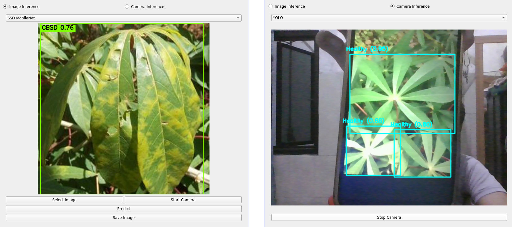

# Cassava Leaf Disease Detection GUI
A Python-based desktop application for detecting cassava leaf diseases. Built with PyQt5, the application supports both SSD MobileNet and YOLOv8 models.

## Features
- [x] Image Inference
- [x] Camera Capture & Inference
- [x] Realtime Detection
- [x] Result Saving

Tested on Ubuntu `20.04`.

## Dependencies
- opencv-python
- PyQt5
- tflite-runtime

## Screenshots
<p align="center"> 
  
</p>

## Installation in ubuntu 20
### Installing Ubuntu Packages
```bash
sudo apt-get install -y \
    python3 \
    python3-pyqt5* \
    pyqt5* \
    python3-opencv \
    python3-pip \
    qt5-qmake \
    qtbase5-dev \
    qtchooser

```
### Installing Python Packages
```bash
pip3 install tflite-runtime opencv-python PyQt5
```
## Installation using docker container
### Build Docker Image
```
docker build -t pyqt5-env -f Dockerfile
```
### Create container
```
docker run -it --name pyqt5-env -e DISPLAY -v $PWD:/workspace -v /tmp/.X11-unix:/tmp/.X11-unix:rw -w /workspace pyqt5-env bash
```
## Usage
```bash
python3 main.py
```
## Autostart
enable and start cronjob
```bash
systemctl enable cron.service
systemctl start cron.service
```
edit crontab by using `crontab -e` then filled it with this config below
```cfg
@reboot DISPLAY=:0 python3 /absolute_path/main.py 
```
